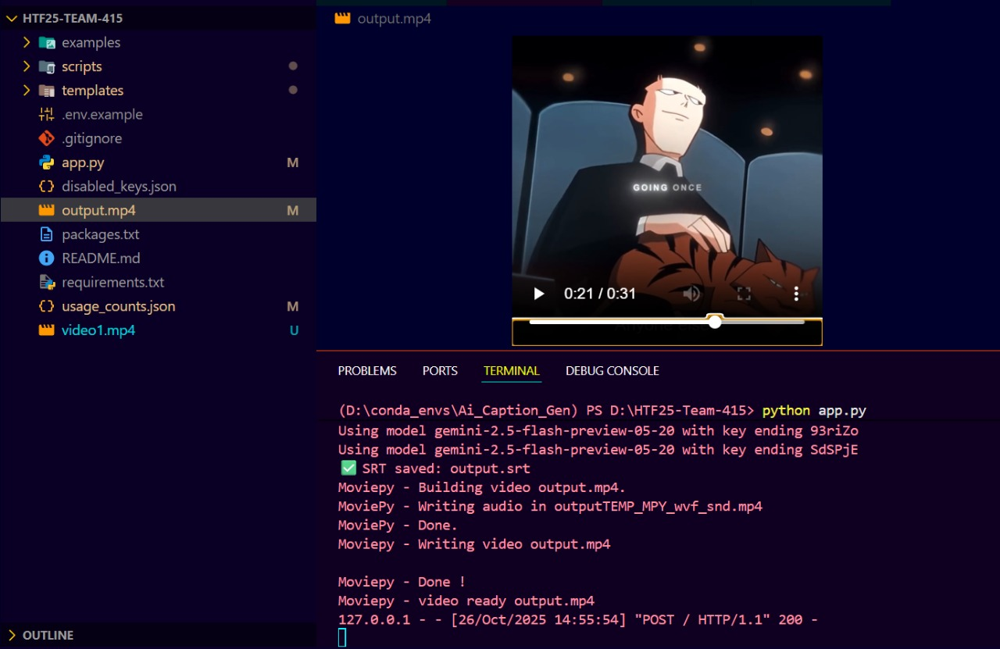

# HTF25-Team-415 - AI-Powered Video Caption Generator

<div align="center">


**Transform your videos with AI-powered captions in multiple languages and styles**

[](https://www.python.org/downloads/)
[](https://flask.palletsprojects.com/)
[](https://github.com/openai/whisper)
[](https://ai.google.dev/)

</div>

---

An intelligent video captioning application that uses OpenAI Whisper for transcription and Google Gemini AI for caption rewriting. This tool automatically generates and overlays stylized captions on your videos.

## 🌟 Features

- **Automatic Transcription**: Uses OpenAI Whisper to transcribe video audio
- **AI Caption Rewriting**: Leverages Google Gemini AI to rewrite captions in different styles
- **Multi-language Support**: Generate captions in 10+ languages (English, Hindi, Spanish, French, German, etc.)
- **Video Overlay**: Automatically overlays captions on your video using PIL (no ImageMagick required)
- **Beautiful Web Interface**: Modern, responsive Flask web interface with drag & drop support
- **Multiple Caption Styles**: Choose from 6 styles - Casual, Formal, Funny, Dramatic, Minimal, Educational
- **Unique File Management**: All outputs saved with timestamps in organized `outputs/` folder
- **Dual Download**: Get both captioned video (.mp4) and subtitle file (.srt)
- **Result Page**: Beautiful success page with confetti animation and download options
- **Secure**: File validation, size limits (500MB), and automatic temp file cleanup

## � Screenshots

### Web Application Interface


_Modern, responsive web interface with drag & drop support, multiple style options, and language selection_

### Output Sample - Video with AI-Generated Captions


_Example of processed video with AI-generated captions overlaid in selected style and language_

## �📋 Prerequisites

Before you begin, ensure you have the following installed:

- **Python 3.10+**
- **Conda** (Anaconda or Miniconda)
- **Git**

## 🚀 Installation

### Step 1: Clone the Repository

```powershell
git clone https://github.com/chiluverugirish/HTF25-Team-415.git
cd HTF25-Team-415
```

### Step 2: Create Conda Environment

```powershell
conda create -n htf25 python=3.10 -y
```

### Step 3: Activate the Environment

```powershell
conda activate htf25
```

### Step 4: Install System Dependencies

Install FFmpeg and ImageMagick (required for video processing):

```powershell
conda install -c conda-forge ffmpeg imagemagick -y
```

### Step 5: Install Python Dependencies

```powershell
pip install -r requirements.txt
```

### Step 6: Set Up Environment Variables

Create a `.env` file in the project root directory and add your API keys:

```env
GEMINI_API_KEY=your_gemini_api_key_here
```

To get a Gemini API key:

1. Visit [Google AI Studio](https://makersuite.google.com/app/apikey)
2. Sign in with your Google account
3. Create a new API key
4. Copy and paste it into your `.env` file

### Step 7: Verify Installation

```powershell
python -c "import streamlit; import whisper; import moviepy; print('✅ All packages installed successfully!')"
```

## 🎯 Usage

### Running the Application

#### Quick Start (Recommended):

```powershell
# Using startup script
.\start.ps1
```

Or manually:

```powershell
# Activate environment
conda activate D:\conda_envs\Ai_Caption_Gen

# Start the app
python app.py
```

The application will automatically open in your default browser at `http://127.0.0.1:5000/`

### Using the Application


1. **Upload Video**: Click the upload area or drag & drop your video file
2. **Choose Style**: Select from 6 caption styles (casual, formal, funny, dramatic, minimal, educational)
3. **Select Language**: Choose output language from 10+ supported languages
4. **Generate**: Click "Generate Captions" and wait for processing
5. **Download**: Get both the captioned video and SRT subtitle file
6. **Access Files**: All outputs are saved in the `outputs/` folder with unique timestamped names

### Sample Output



The above image shows an example of the final output - a video with AI-generated captions overlaid in your selected style and language.

## 🎬 How It Works

```
┌─────────────────────┐
│   Upload Video      │  ← User uploads video via web interface
└──────────┬──────────┘
           ↓
┌─────────────────────┐
│  Whisper AI         │  ← OpenAI Whisper transcribes audio
│  Transcription      │
└──────────┬──────────┘
           ↓
┌─────────────────────┐
│  Gemini AI          │  ← Google Gemini rewrites in selected style
│  Caption Rewriting  │
└──────────┬──────────┘
           ↓
┌─────────────────────┐
│  SRT Generation     │  ← Generate standard subtitle file
└──────────┬──────────┘
           ↓
┌─────────────────────┐
│  Caption Overlay    │  ← Overlay captions on video using PIL
└──────────┬──────────┘
           ↓
┌─────────────────────┐
│  Download Results   │  ← Get captioned video + SRT file
└─────────────────────┘
```

## 📁 Project Structure

```
HTF25-Team-415/
├── app.py                          # Main Flask application
├── requirements.txt                # Python dependencies
├── packages.txt                    # System dependencies
├── disabled_keys.json             # Configuration file
├── usage_counts.json              # Usage tracking
├── scripts/
│   ├── transcribe.py              # Video transcription module
│   ├── generate_srt.py            # SRT subtitle generation
│   ├── rewrite_captions_gemini.py # AI caption rewriting
│   ├── overlay.py                 # Video caption overlay
│   └── runall.py                  # Batch processing script
├── templates/
│   └── index.html                 # Web interface template
└── examples/                      # Example videos/outputs
```

## 🛠️ Dependencies

### Python Packages

- **Flask**: Web framework
- **streamlit**: Alternative UI framework
- **openai-whisper**: Audio transcription
- **moviepy**: Video processing
- **google-generativeai**: Gemini AI integration
- **python-dotenv**: Environment variable management
- **pysrt**: SRT file handling

### System Packages

- **FFmpeg**: Video encoding/decoding
- **ImageMagick**: Image processing

## 🔧 Troubleshooting

### Common Issues

**Issue**: FFmpeg not found

```powershell
# Solution: Reinstall FFmpeg
conda install -c conda-forge ffmpeg -y
```

**Issue**: Whisper model download fails

```powershell
# Solution: Manually download the model
python -c "import whisper; whisper.load_model('base')"
```

**Issue**: ImportError for moviepy

```powershell
# Solution: Reinstall moviepy
pip uninstall moviepy -y
pip install moviepy==1.0.3
```

**Issue**: Gemini API error

- Verify your API key is correct in the `.env` file
- Check your API quota at [Google AI Studio](https://makersuite.google.com/)

## 🌐 Environment Management

### Activate Environment

```powershell
conda activate htf25
```

### Deactivate Environment

```powershell
conda deactivate
```

### Remove Environment (if needed)

```powershell
conda deactivate
conda remove -n htf25 --all -y
```

## 🤝 Contributing

This project was created for HTF25 (Hackathon). To contribute:

1. Fork the repository
2. Create a new branch (`git checkout -b feature-name`)
3. Make your changes
4. Commit your changes (`git add . && git commit -m "Add feature"`)
5. Push to your fork (`git push origin feature-name`)
6. Create a Pull Request

## 📝 License

This project is part of the HTF25 hackathon.

## 👥 Team

**Team 415** - HTF25 Hackathon Participants

## 🎨 Results Showcase

### Application Interface

Our modern web interface with gradient design and intuitive controls:

<div align="center">
  
  <p><i>Beautiful web interface with drag & drop support, multiple style options, and responsive design</i></p>
</div>

### Sample Output

Example of AI-generated captions overlaid on video with selected style and language:

<div align="center">
  
  <p><i>Professional caption overlay showing AI-enhanced text in the selected style</i></p>
</div>

### Key Visual Features

- 🎨 **Modern UI Design**: Purple gradient theme with smooth animations
- 🖱️ **Drag & Drop**: Intuitive file upload with visual feedback
- 📱 **Responsive Layout**: Works seamlessly on all devices
- 🎬 **Professional Output**: High-quality caption overlay with customizable styles
- 📊 **Success Page**: Confetti animation with download options
- 📁 **Organized Storage**: Timestamped files in dedicated outputs folder

## 🙏 Acknowledgments

- OpenAI Whisper for transcription capabilities
- Google Gemini AI for caption rewriting
- The open-source community for amazing libraries

## 📞 Support

If you encounter any issues or have questions:

1. Check the [Troubleshooting](#-troubleshooting) section
2. Open an issue on GitHub
3. Contact the team maintainers

---

**Happy Captioning! 🎬✨**
