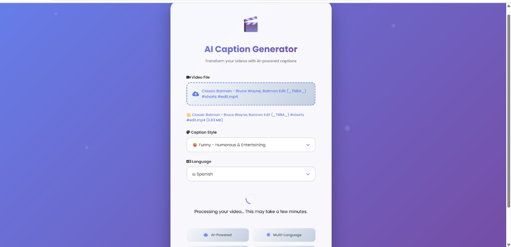

# 🎬 AI-Powered Video Caption Generator

<div align="center">



**Transform your videos with AI-powered captions in multiple languages and styles**

[](https://www.python.org/downloads/)
[](https://flask.palletsprojects.com/)
[](https://github.com/guillaumekln/faster-whisper)
[](https://ai.google.dev/)
[](https://www.sqlite.org/)
[](https://developer.nvidia.com/cuda-toolkit)

</div>

---

## 📝 Project Overview

An intelligent video captioning application built for **HTF25 Hackathon** that combines cutting-edge AI models for automatic video transcription, caption enhancement, and multilingual translation. Upload any video, select your preferred style and language, and get professionally captioned videos in seconds!

### 🎯 Key Capabilities

- **🎤 Speech-to-Text**: Powered by faster-whisper (4-8x faster than OpenAI Whisper)
- **✨ AI Enhancement**: Google Gemini 2.5 Flash removes filler words and polishes captions
- **🌍 Multilingual**: Translate captions to 12+ languages
- **🎨 Style Options**: Casual, Professional, Educational, Humorous
- **👥 User Authentication**: Login system with SQLite database
- **📊 Video History**: Track all processed videos (for logged-in users)
- **⚡ GPU Acceleration**: CUDA support for 4-10x faster processing

---

## 🚀 Complete Tech Stack

### **Backend**

| Technology                  | Purpose                           | Version  |
| --------------------------- | --------------------------------- | -------- |
| **Flask**                   | Web framework                     | Latest   |
| **Python**                  | Programming language              | 3.10+    |
| **SQLite3**                 | Database (user auth & history)    | Built-in |
| **faster-whisper**          | Speech-to-text (4-8x faster)      | Latest   |
| **Google Gemini 2.5 Flash** | Caption enhancement & translation | API      |
| **MoviePy**                 | Video processing & overlay        | 1.0.3    |
| **FFmpeg**                  | Video encoding/decoding           | Latest   |
| **PIL/Pillow**              | Text rendering on videos          | Latest   |

### **AI Models**

| Model                                       | Task                         | Performance        |
| ------------------------------------------- | ---------------------------- | ------------------ |
| **faster-whisper** (tiny/base/small/medium) | Audio → Text transcription   | 0.5-30s per minute |
| **Gemini 2.5 Flash**                        | Text polishing & translation | 1-2s per segment   |

**Model Options:**

- `tiny` (39M params): Fastest, 32x realtime
- `base` (74M params): Balanced, 16x realtime ✨ **Recommended**
- `small` (244M params): Quality, 6x realtime
- `medium` (769M params): Best accuracy, 2x realtime

### **Frontend**

| Technology                 | Purpose                                   |
| -------------------------- | ----------------------------------------- |
| **HTML5**                  | Structure & semantic markup               |
| **CSS3**                   | Custom styling, gradients, animations     |
| **JavaScript**             | Interactivity, video controls, validation |
| **Font Awesome 6.4.0**     | Icons (CDN)                               |
| **Google Fonts (Poppins)** | Typography                                |

**Responsive Design:**

- Desktop: >1024px
- Tablet: 768px-1024px
- Mobile: <768px

### **Database Schema**

```sql
-- Users table
CREATE TABLE users (
    id INTEGER PRIMARY KEY,
    username TEXT UNIQUE,
    email TEXT UNIQUE,
    password_hash TEXT,
    created_at TIMESTAMP
);

-- Videos table
CREATE TABLE videos (
    id INTEGER PRIMARY KEY,
    user_id INTEGER,
    original_filename TEXT,
    video_file TEXT,
    srt_file TEXT,
    style TEXT,
    language TEXT,
    processed_at TIMESTAMP,
    FOREIGN KEY (user_id) REFERENCES users(id)
);
```

### **Authentication & Security**

- **Password Hashing**: SHA-256
- **SQL Injection Protection**: Parameterized queries
- **XSS Protection**: HTTPOnly cookies
- **Session Management**: Flask sessions (2-hour timeout)
- **File Validation**: Extension & size checks (max 500MB)

### **GPU Acceleration**

- **CUDA Version**: 12.0
- **GPU**: NVIDIA GTX 1050 (4GB VRAM)
- **Optimization**: FP16 precision on GPU, INT8 on CPU
- **Speedup**: 4-10x faster than CPU

### **API Integration**

- **Gemini API**: 28 keys with automatic rotation
- **Rate Limiting**: 500 requests/day per key
- **Fallback**: Auto-retry with exponential backoff
- **Tracking**: Usage counts and disabled keys logging

---

## 🌟 Features

- **Automatic Transcription**: Uses faster-whisper for high-speed video audio transcription (4-8x faster than OpenAI Whisper)
- **AI Caption Rewriting**: Leverages Google Gemini 2.5 Flash to enhance and translate captions in different styles
- **Multi-language Support**: Translate and generate captions in 10+ languages (English, Hindi, Spanish, French, German, etc.)
- **Video Overlay**: Automatically overlays captions on your video using PIL and MoviePy
- **Beautiful Web Interface**: Modern, responsive Flask web interface with drag & drop support
- **Multiple Caption Styles**: Choose from 6 styles - Casual, Formal, Funny, Dramatic, Minimal, Educational
- **Model Selection**: Choose from 4 Whisper model variants (tiny/base/small/medium) for speed vs accuracy tradeoff
- **GPU Acceleration**: CUDA-optimized faster-whisper with FP16 precision for maximum performance
- **Unique File Management**: All outputs saved with timestamps in organized `outputs/` folder
- **Dual Download**: Get both captioned video (.mp4) and subtitle file (.srt)
- **User Authentication**: Secure login system with password hashing and session management
- **Result Page**: Beautiful success page with confetti animation and download options
- **Comprehensive Logging**: Detailed console output tracking each processing stage with timing metrics
- **Secure**: File validation, size limits (500MB), and automatic temp file cleanup

## � Screenshots

### Web Application Interface


_Modern, responsive web interface with drag & drop support, multiple style options, and language selection_

### Output Sample - Video with AI-Generated Captions


_Example of processed video with AI-generated captions overlaid in selected style and language_

## �📋 Prerequisites

Before you begin, ensure you have the following installed:

- **Python 3.10+**
- **Conda** (Anaconda or Miniconda)
- **Git**

## 🚀 Installation

### Step 1: Clone the Repository

```powershell
git clone https://github.com/chiluverugirish/HTF25-Team-415.git
cd HTF25-Team-415
```

### Step 2: Create Conda Environment

```powershell
conda create -n htf25 python=3.10 -y
```

### Step 3: Activate the Environment

```powershell
conda activate htf25
```

### Step 4: Install System Dependencies

Install FFmpeg and ImageMagick (required for video processing):

```powershell
conda install -c conda-forge ffmpeg imagemagick -y
```

### Step 5: Install Python Dependencies

```powershell
pip install -r requirements.txt
```

### Step 6: Set Up Environment Variables

Create a `.env` file in the project root directory and add your API keys:

```env
GEMINI_API_KEY=your_gemini_api_key_here
```

To get a Gemini API key:

1. Visit [Google AI Studio](https://makersuite.google.com/app/apikey)
2. Sign in with your Google account
3. Create a new API key
4. Copy and paste it into your `.env` file

### Step 7: Verify Installation

```powershell
python -c "from faster_whisper import WhisperModel; import moviepy; from google import generativeai; print('✅ All packages installed successfully!')"
```

## 🎯 Usage

### Running the Application

#### Quick Start (Recommended):

```powershell
# Using startup script
.\start.ps1
```

Or manually:

```powershell
# Activate environment
conda activate D:\conda_envs\Ai_Caption_Gen

# Start the app
python app.py
```

The application will automatically open in your default browser at `http://127.0.0.1:5000/`

### Using the Application


1. **Upload Video**: Click the upload area or drag & drop your video file
2. **Choose Style**: Select from 6 caption styles (casual, formal, funny, dramatic, minimal, educational)
3. **Select Language**: Choose output language from 10+ supported languages (Gemini will translate)
4. **Choose Speed**: Select Whisper model variant (tiny/base/small/medium) for speed vs accuracy tradeoff
5. **Generate**: Click "Generate Captions" and watch real-time processing logs
6. **Download**: Get both the captioned video and SRT subtitle file from the success page
7. **Access Files**: All outputs are saved in the `outputs/` folder with unique timestamped names

### Sample Output


The above image shows an example of the final output - a video with AI-generated captions overlaid in your selected style and language.

## 🎬 How It Works

```
┌─────────────────────┐
│   Upload Video      │  ← User uploads video via web interface
└──────────┬──────────┘
           ↓
┌─────────────────────┐
│  faster-whisper     │  ← Speech-to-text transcription (4-8x faster)
│  Transcription      │     with GPU acceleration (CUDA FP16)
└──────────┬──────────┘
           ↓
┌─────────────────────┐
│  Gemini 2.5 Flash   │  ← AI enhancement: translate + rewrite
│  Caption Rewriting  │     in selected style (28 API keys)
└──────────┬──────────┘
           ↓
┌─────────────────────┐
│  SRT Generation     │  ← Generate standard subtitle file format
└──────────┬──────────┘
           ↓
┌─────────────────────┐
│  Caption Overlay    │  ← Overlay captions on video using MoviePy + PIL
└──────────┬──────────┘
           ↓
┌─────────────────────┐
│  Download Results   │  ← Get captioned video (.mp4) + SRT file (.srt)
└─────────────────────┘
```

## 📁 Project Structure

```
HTF25-Team-415/
├── app.py                          # Main Flask application
├── requirements.txt                # Python dependencies
├── packages.txt                    # System dependencies
├── disabled_keys.json             # Configuration file
├── usage_counts.json              # Usage tracking
├── scripts/
│   ├── transcribe.py              # Video transcription module
│   ├── generate_srt.py            # SRT subtitle generation
│   ├── rewrite_captions_gemini.py # AI caption rewriting
│   ├── overlay.py                 # Video caption overlay
│   └── runall.py                  # Batch processing script
├── templates/
│   └── index.html                 # Web interface template
└── examples/                      # Example videos/outputs
```

## 🛠️ Dependencies

### Python Packages

- **Flask**: Web framework and routing
- **faster-whisper**: High-performance audio transcription (4-8x faster than OpenAI Whisper)
- **moviepy**: Video processing and manipulation
- **google-generativeai**: Gemini AI integration for caption enhancement
- **python-dotenv**: Environment variable management
- **pysrt**: SRT subtitle file handling
- **Pillow (PIL)**: Text rendering and image processing
- **torch**: PyTorch for deep learning inference
- **numpy**: Numerical computing

### System Packages

- **FFmpeg**: Video encoding/decoding
- **CUDA Toolkit 12.0**: GPU acceleration (NVIDIA only)

## 🔧 Troubleshooting

### Common Issues

**Issue**: FFmpeg not found

```powershell
# Solution: Reinstall FFmpeg
conda install -c conda-forge ffmpeg -y
```

**Issue**: faster-whisper model download fails

```powershell
# Solution: Manually download the model
python -c "from faster_whisper import WhisperModel; model = WhisperModel('base', device='cpu')"
```

**Issue**: CUDA out of memory error

```powershell
# Solution: Use smaller Whisper model or switch to CPU
# Edit scripts/transcribe.py and change model size from 'medium' to 'base' or 'tiny'
```

**Issue**: ImportError for moviepy

```powershell
# Solution: Reinstall moviepy
pip uninstall moviepy -y
pip install moviepy==1.0.3
```

**Issue**: Gemini API error

- Verify your API key is correct in the `.env` file
- Check your API quota at [Google AI Studio](https://makersuite.google.com/)

## 🌐 Environment Management

### Activate Environment

```powershell
conda activate htf25
```

### Deactivate Environment

```powershell
conda deactivate
```

### Remove Environment (if needed)

```powershell
conda deactivate
conda remove -n htf25 --all -y
```

## 🤝 Contributing

This project was created for HTF25 (Hackathon). To contribute:

1. Fork the repository
2. Create a new branch (`git checkout -b feature-name`)
3. Make your changes
4. Commit your changes (`git add . && git commit -m "Add feature"`)
5. Push to your fork (`git push origin feature-name`)
6. Create a Pull Request

## 📝 License

This project is part of the HTF25 hackathon.

## 👥 Team

**Team 415** - HTF25 Hackathon Participants

## 🎨 Results Showcase

### Application Interface

Our modern web interface with gradient design and intuitive controls:

<div align="center">
  
  <p><i>Beautiful web interface with drag & drop support, multiple style options, and responsive design</i></p>
</div>

### Sample Output

Example of AI-generated captions overlaid on video with selected style and language:

<div align="center">
  
  <p><i>Professional caption overlay showing AI-enhanced text in the selected style</i></p>
</div>

### Key Visual Features

- 🎨 **Modern UI Design**: Purple gradient theme with smooth animations
- 🖱️ **Drag & Drop**: Intuitive file upload with visual feedback
- 📱 **Responsive Layout**: Works seamlessly on all devices
- 🎬 **Professional Output**: High-quality caption overlay with customizable styles
- 📊 **Success Page**: Confetti animation with download options
- 📁 **Organized Storage**: Timestamped files in dedicated outputs folder

## 🙏 Acknowledgments

- **faster-whisper** by Systran for high-performance speech-to-text transcription
- **Google Gemini 2.5 Flash** for AI-powered caption enhancement and translation
- **OpenAI** for the original Whisper architecture
- The open-source community for amazing libraries (MoviePy, Flask, PIL, PyTorch)

## 📞 Support

If you encounter any issues or have questions:

1. Check the [Troubleshooting](#-troubleshooting) section
2. Open an issue on GitHub
3. Contact the team maintainers

---

**Happy Captioning! 🎬✨**
